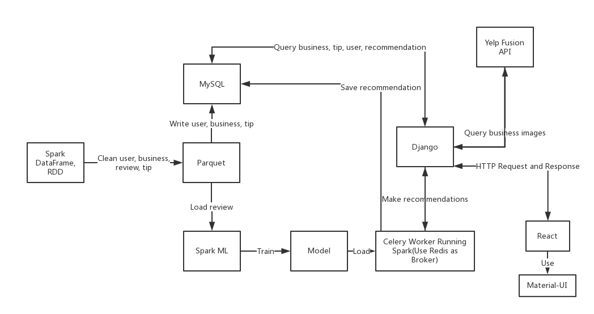
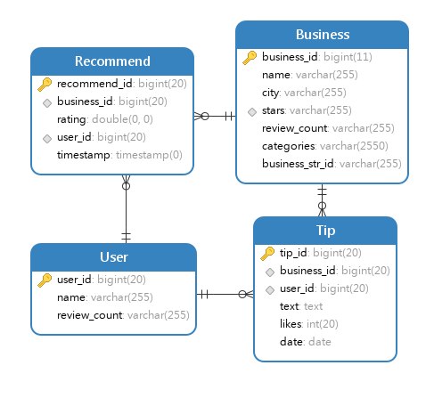
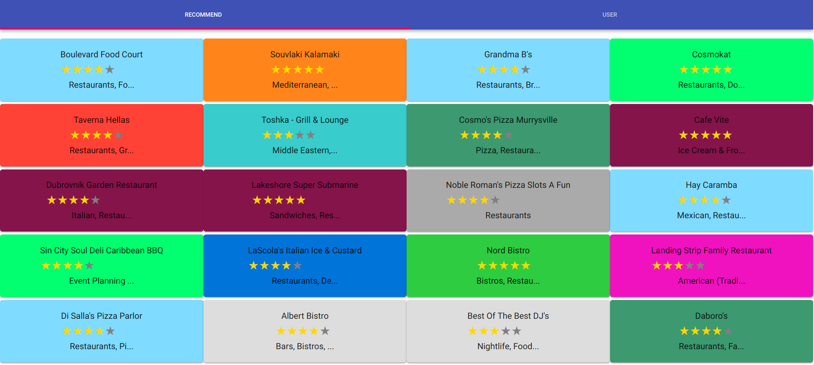
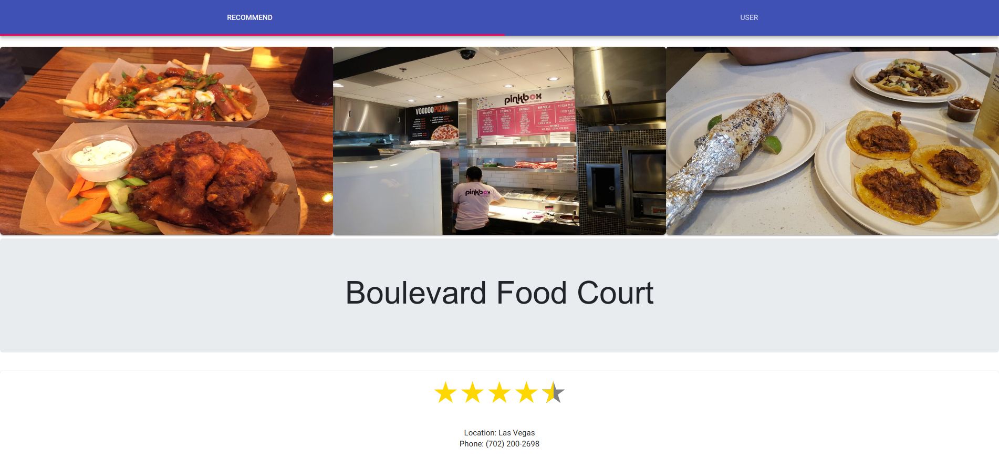
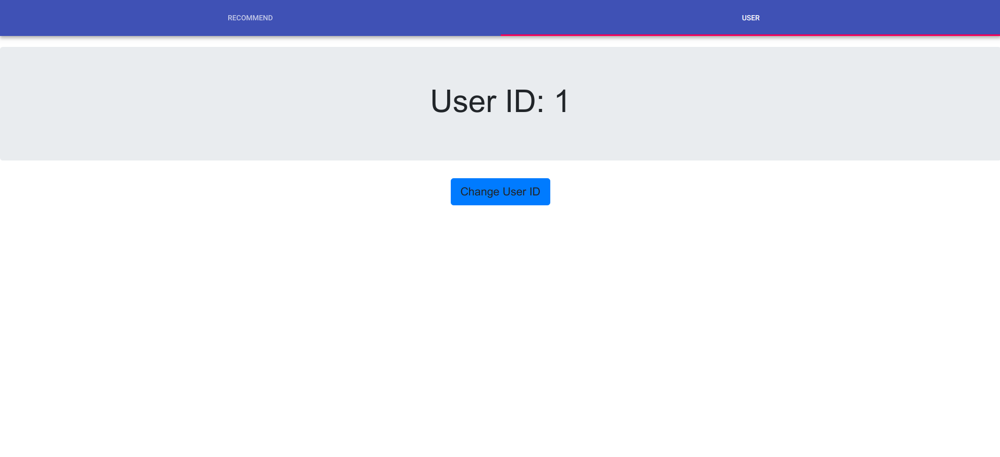
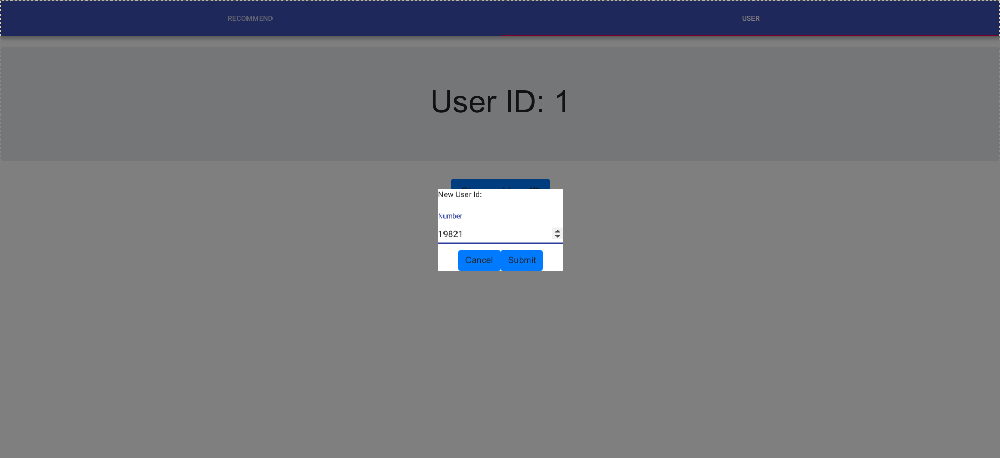

## Web Frontend

http://localhost:3000/

## Project Description

This project is a restaurants recommendation system using Collaborative Filtering. It makes recommendations based on user reviews, to find out those with similar interest and recommend based on that.

When a user login, Django will call Spark through Celery to make recommendations for this user based on trained model loaded in Spark application. Once done, it will cache the result into MySQL and return the result to Django. Next time the user login, Django will get cached recommendations from MySQL.

## Technology

PySpark DataFrame, PySpark RDD, PySpark ML, Redis, Celery, MySQL, Django, Yelp Fusion API, React, Material-UI.



## Database Design



## Screenshots







## Running Instructions

### Input files

Download Yelp Dataset from https://www.yelp.com/dataset/download, uncompress and put them in `etlAndTrainModel/dataset`.


### How to import MySQL database

```
mysql -u username -p YelpRecommender < YelpRecommender.sql
```

In MySQL:

```
CREATE USER 'yelp'@'localhost' IDENTIFIED BY 'yelp';
GRANT SELECT, INSERT, DELETE ON YelpRecommender.* TO yelp@'localhost';
```


### How to run ETL code

```
spark-submit clean_data_to_parquet.py

spark-submit clean_tip_to_parquet.py

spark-submit --packages mysql:mysql-connector-java:5.1.39 write_parquet_to_mysql.py

spark-submit --packages mysql:mysql-connector-java:5.1.39 clean_str_business_id_to_parquet.py
```

In MYSQL: 

```
use YelpRecommender
delete from Business;
```

```
spark-submit --packages mysql:mysql-connector-java:5.1.39 write_business_with_str_id_to_mysql.py
```

### How to run model training code

```
spark-submit train_model_all_data.py
```

The RMSE is 3.313339901807028.

### How to use trained model to make recommendations for test

```
spark-submit --packages mysql:mysql-connector-java:5.1.39 use_model.py
```

### How to run the web application with real-time recommendation spark

Run backend:

```
cd backendWithCelery/
source venv/bin/activate
python yelp_recommender/manage.py runserver
```

Run redis as broker for celery:

```
./redis-server
```

Run celery worker:

```
cd backendWithCelery/yelp_recommender/business/ml/
python3.6 -m celery -A tasks worker --loglevel=info --hostname=worker1@%h
```

Run front end:

```
cd frontEnd/
npm start
```

## Reference

https://www.codementor.io/jadianes/building-a-recommender-with-apache-spark-python-example-app-part1-du1083qbw
https://www.codementor.io/jadianes/building-a-web-service-with-apache-spark-flask-example-app-part2-du1083854

https://spark.apache.org/docs/latest/ml-collaborative-filtering.html

https://www.djangoproject.com/start/

http://docs.celeryproject.org/en/latest/django/first-steps-with-django.html
http://docs.celeryproject.org/en/latest/userguide/security.html
http://docs.celeryproject.org/en/latest/userguide/configuration.html#std:setting-task_serializer
http://docs.celeryproject.org/en/latest/getting-started/brokers/redis.html

https://bugra.github.io/work/notes/2014-04-19/alternating-least-squares-method-for-collaborative-filtering/#Intuition
https://www.quora.com/What-is-the-difference-between-content-based-filtering-and-collaborative-filtering